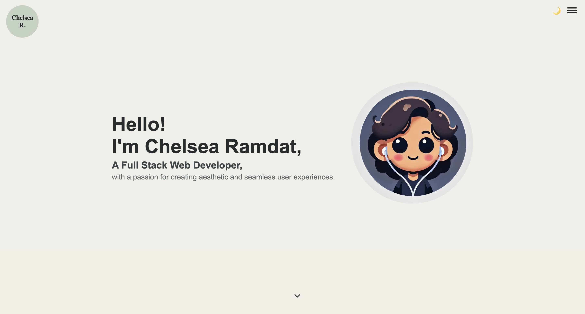
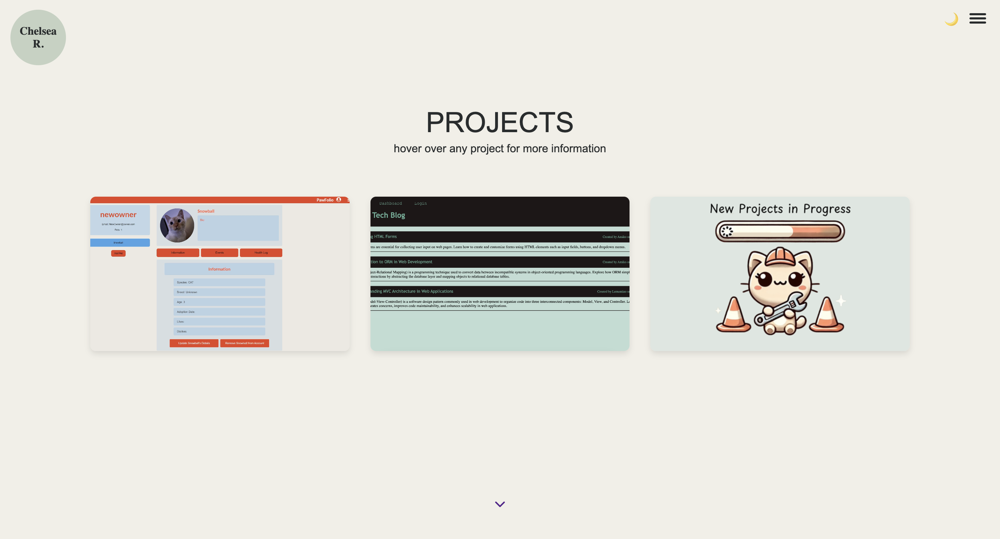
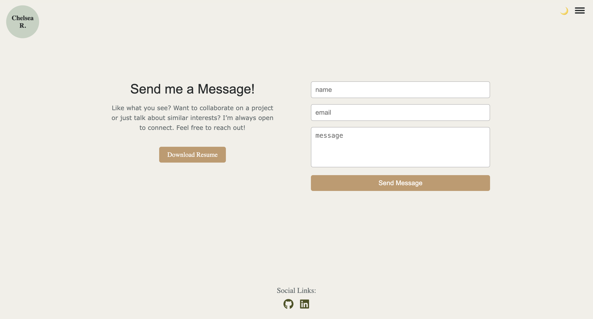

# Chelsea Ramdat - Web Developer Portfolio

Welcome to my developer portfolio! This project highlights my journey and skills as a junior web developer and experience in building real-world applications. Through this portfolio, I aim to share my technical expertise, unique insights, and passion for creating user-friendly, impactful applications.

---

## Features

- **Dynamic Project Showcase**: A gallery of projects that demonstrate my skills in frontend, backend, and database management, with links to live applications and source code.
- **Responsive Design**: Optimized for viewing across all devices, ensuring an accessible experience on desktop and mobile.
- **Contact Form Integration**: Connect directly with me via a simple contact form (secured with OAuth2 for Gmail integration).
- **Subtle Animations**: Engaging animations that enhance user experience without overwhelming the interface.

---

## Technologies Used

### Frontend
- HTML, CSS, JavaScript
- React

### Backend
- Node.js, Express
- Body-Parser middleware for parsing request bodies
- Nodemailer for email functionality, including Gmail integration
- Google APIs for Gmail OAuth2 authentication

### DevOps & Security
- GitHub for version control
- Heroku for cloud deployment
- OAuth for secure authentication

---

## Portfolio Structure

- **config/** - Configuration files for the portfolio project.
  - **vite.config.js** - Configuration for Vite.
  - **server.js** - Backend server configuration.
  - **.eslintrc.cjs** - ESLint configuration for code quality and style.

- **public/** - Static files such as images, fonts, and other assets.
  - **favicon.ico** - Favicon for the portfolio.

- **src/** - Contains all the source code for the portfolio.
  - **assets/** 
    - **files/** - Documents or downloadable resources.
    - **images/** - Images used in the portfolio.
  - **components/** - Reusable components like `Navbar`, `Footer`, and `Project`.
  - **pages/** - Individual sections of the portfolio, such as `Home`, `About`, `Projects`, and `Contact`.
  - **App.jsx** - Root application component.
  - **main.jsx** - Entry point for React rendering.

- **.env** - Environment variables for sensitive data.
- **.gitignore** - Specifies files and directories to ignore in Git.
- **index.html** - Main HTML file for the app.
- **package.json** - Project metadata and dependencies.
- **README.md** - Documentation file.

---

## Usage

Navigate through the portfolio to explore each section:

1. **Home**: A brief introduction to my background, skills, and professional aspirations.
2. **Projects**: A curated selection of completed projects, each showcasing specific skills and technologies. Each project includes links to the source code and live app.
3. **About Me**: Learn about my interests and how I leverage my unique background in my work.
4. **Contact**: A secure contact form, integrated with OAuth2 for Gmail, to send messages directly to me.

---

## Screenshots

Here's a preview of the portfolio:

### Homepage

*An engaging overview with links to key sections.*

### Projects Section

*A showcase of my top projects, with descriptions, technologies used, and links.*

### Contact Section

*A simple and secure form for reaching out directly.*

---

## Contact

I'm open to connecting with other developers, collaborating on projects, or exploring new opportunities. Feel free to reach out through any of the following:

- **LinkedIn**: [My LinkedIn](https://www.linkedin.com/in/chelsea-ramdat)
- **GitHub**: [My GitHub](https://github.com/ChelsR29)

---

## Link to Deployed Application

https://main--chelsea-react-portfolio.netlify.app/